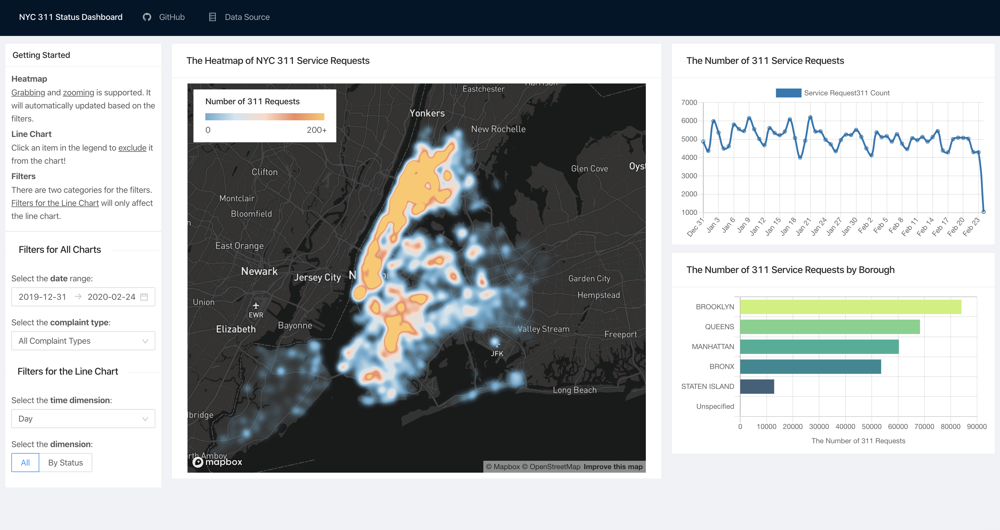
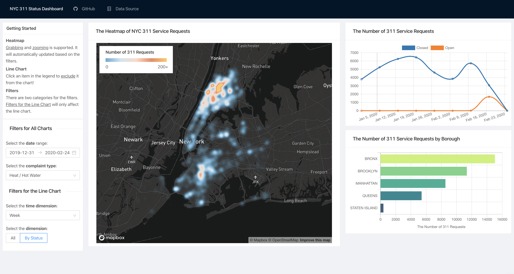

# Dashboard for NYC 311 Data
## Si Young Byun

This is a dashboard for [NYC 311 data](https://data.cityofnewyork.us/Social-Services/311-Service-Requests-from-2010-to-Present/erm2-nwe9) built in `React`, `Mapbox` and `PostgreSQL` as a final project for *CAPP 30239 - Data Visualization for Public Policy*.

For the best performance, set the browser's width to __1680px__.

## Examples

## Built With

* [React](https://reactjs.org/)
* [Cube-js](https://cube.dev/)
* [Mapbox](https://www.mapbox.com/)
* [PostgreSQL](https://www.postgresql.org/)

## Author

* **Si Young Byun** - [GitHub](https://github.com/siyoungbyun)

## Acknowledgments

* Andrew McNutt and amazing TAs with awesome feedback and guide.
